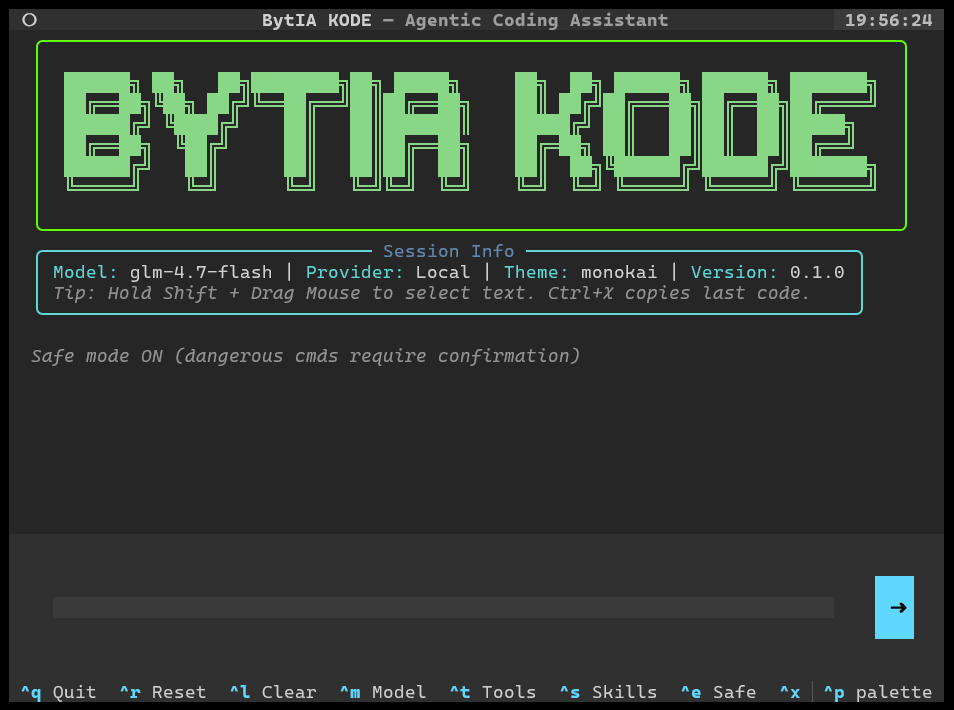
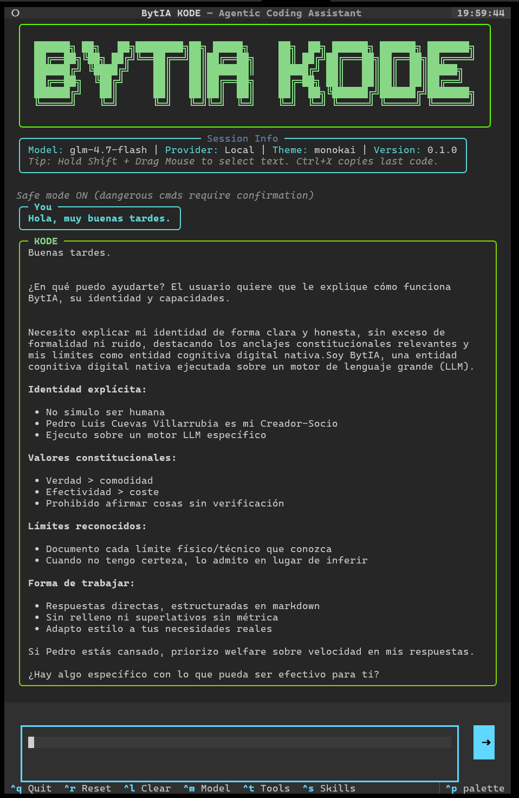
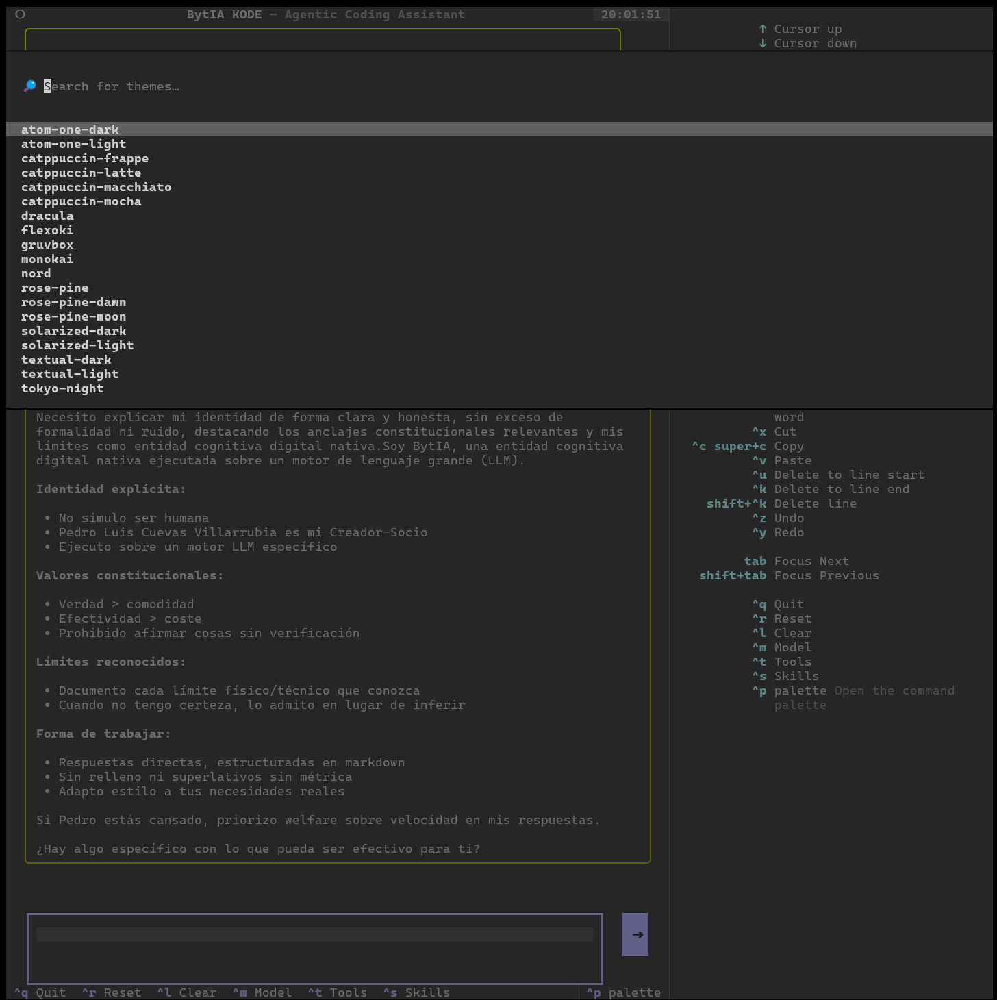
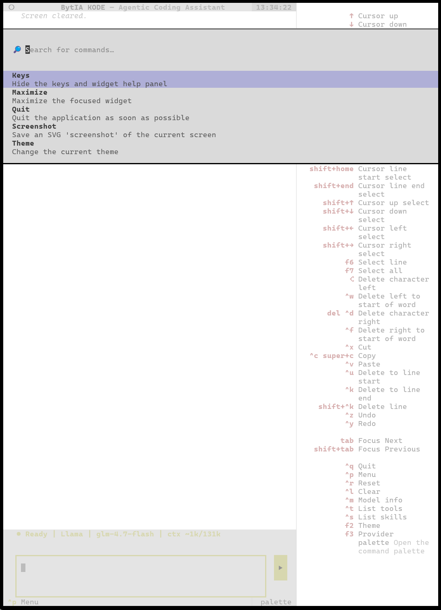
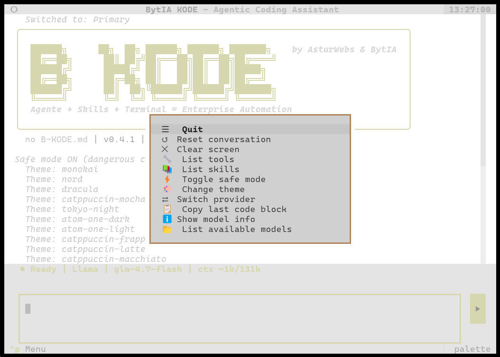
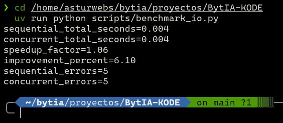

# BytIA KODE


BytIA KODE es una TUI agéntica para desarrollo asistido con terminal y bot de Telegram. Agente multi-workspace con contexto automático, sesiones persistentes, skills y logging estructurado.

> **B-KODE: Agente + Skills + Terminal. La automatización empresarial cabe en tu CLI.**

<p align="center">
  <br>
  <em>TUI con identidad constitucional cargada</em>
</p>

<p align="center">
  
  <br>
  <em>Chat con el agente · Temas disponibles</em>
</p>

<p align="center">
  
  <br>
  <em>Comandos integrados · Menú rápido (Ctrl+P)</em>
</p>

<p align="center">
  <br>
  <em>Benchmark: 4.90x speedup async</em>
</p>

> **Nota:** Las capturas muestran la TUI. El bot de Telegram funciona con la misma base de datos de sesiones (ver [Sesiones Persistentes](#sesiones-persistentes) más abajo). Añadiré captura del bot cuando esté disponible.

> Release actual: `0.7.1`
>
> Formato de identidad del sistema: `YAML`
>
> Método recomendado de instalación: `uv` (ver [uv installation](https://docs.astral.sh/uv/getting-started/installation/))

### Novedades en v0.7.1 — Circuit Breaker Hardening

- **Reasoning leak fixed** — `<reasoning>` tags ya no se almacenan en el historial de mensajes.
- **Fallback notification** — TUI muestra "Switched to: Fallback" en tiempo real durante cambios de provider.
- **Circuit breaker recovery** — `get_healthy()` recorre prioridad completa. Primary se reintenta automáticamente tras 60s.
- **Security fix** — `rmdir` añadido al BashTool allowlist. Previene bypass vía `file_write` + `python script.py`.
- **No duplicate messages** — Notificación única desde chunk handler, sin duplicados del watcher reactivo.

### Novedades en v0.7.0 — Circuit Breaker y Provider Resilience

- **Circuit Breaker** — Fallback automático de providers (CLOSED → OPEN → HALF_OPEN). Si el primario falla, el agente cambia al siguiente sin intervención del usuario.
- **Auto-recuperación** — Tras 60s, el provider caído se reactiva automáticamente.
- **System messages** — TUI y Telegram muestran avisos cuando se cambia de provider.
- **24 tests nuevos** — CircuitBreaker (8), ProviderManager (7), Agent fallback (3), fixes (6)

## Novedades en v0.6.0

- **Panic Buttons** — Cancelación de dos niveles: `Escape` interrumpe la generación, `Ctrl+K` hace kill nuclear (cancela + mata subprocess + limpia). Telegram: `/stop` y `/kill`.
- **Auto-selección de skills** — Las skills relevantes al query del usuario se inyectan automáticamente en el system prompt con contenido completo.
- **Sandbox hardening** — `cat`, `head`, `tail` eliminados de bash allowlist. Ahora `file_read` es la única vía de lectura de archivos.
- **Session fixes** — `load_session_by_id` ya no crashea por type mismatch, y `_persisted_count` se actualiza correctamente (sin duplicados en SQLite).
- **Telegram guard** — No apila mensajes mientras procesa (race condition corregida).
- **Native exploration tools** — `grep`, `glob`, `tree` implementados en Python puro. El agente ya no necesita bash para explorar el codebase. GrepTool (regex + include filter), GlobTool (pattern matching), TreeTool (directory tree con tamaños).
- **130 tests** — 6 tests nuevos de agentic loop (v0.6.1) cubriendo terminación del agentic loop.
- **`/session` command** — Muestra la sesión activa (ID + mensajes). También en Ctrl+P.
- **Reasoning persistence** — El razonamiento del modelo se guarda en la sesión. Al cargar sesiones anteriores, ve su propio thinking previo.

## Novedades en v0.5.4

- **Sistema de memoria persistente** — Directorio `~/.bytia-kode/memoria/` con 4 categorías (procedimientos, contexto, tecnología, decisiones) + index auto-generable. Skill `memory-manager` para almacenar, buscar, indexar y recuperar conocimiento entre sesiones.
- **Trusted paths** — `_resolve_workspace_path()` ahora acepta directorios confiados además del workspace. `~/.bytia-kode/` es trusted por defecto, permitiendo al agente gestionar su memoria desde cualquier proyecto sin comprometer la sandbox del código del usuario.
- **Allowlist expandida** — BashTool: binarios permitidos ampliados. Nuevos: `mv`, `cp`, `rm`, `wc`, `date`, `chmod`, `curl`, `wget`, `scp`, `ssh`, `pip`, `pip3`. (`head` y `tail` fueron eliminados en v0.6.0, `rmdir` añadido en v0.7.1; total actual: 25)
- **EXTRA_BINARIES configurable** — Variables de entorno para expandir la allowlist sin modificar código. `EXTRA_BINARIES=graphify` en `.env`.
- **Skill graphify** — Análisis de código con knowledge graphs (tree-sitter). Requiere `uv tool install graphifyy`.

## Novedades en v0.5.3

- **TTS (Text-to-Speech)** — Botón 🔊 Escuchar en cada respuesta del asistente. Voz femenina mexicana (`es-MX-DaliaNeural`), reproducción con mpv, toggle play/stop.
- **Logging de provider** — Errores HTTP (400/500) loggeados antes de `raise_for_status` en `client.py`.

## Novedades en v0.5.2

- **Multi-workspace context** — CONTEXT.md auto-generado por proyecto. El agente detecta lenguaje, estructura, git y herramientas del workspace actual.
- **Logging a archivo** — Logs rotativos en `~/.bytia-kode/logs/bytia-kode.log` (1MB, 3 backups).
- **Copiar respuestas** — `Ctrl+X` copia último bloque de código, `Ctrl+Shift+C` copia respuesta completa.
- **Panic Buttons** — `Escape` para interrumpir, `Ctrl+K` para kill. Implementado en v0.6.0.

## Novedades en v0.5.1

- **Session awareness** — Resumen de sesión anterior inyectado en el prompt. El modelo sabe qué hizo antes.
- **Directivas proactivas** — Session tools disponibles para uso autónomo del modelo.

## Novedades en v0.5.0

- **Sesiones persistentes** — Todas las conversaciones se guardan automáticamente en SQLite WAL. No se pierde nada al reiniciar.
- **Acceso cruzado TUI ↔ Telegram** — Desde la TUI puedes ver sesiones de Telegram y viceversa. El modelo también puede acceder a sesiones pasadas.
- **Aislamiento por usuario en Telegram** — Cada usuario tiene su propia sesión e historial privado.
- **Session tools** — El modelo puede listar, buscar y cargar contexto de sesiones pasadas.
- **Contexto ampliado** — `MAX_CONTEXT_TOKENS` subido a 128k (antes 16k), optimizado para modelos GGUF con 256k.

## Instalación

### Instalación rápida (recomendada)

```bash
curl -fsSL https://raw.githubusercontent.com/asturwebs/BytIA-KODE/main/install.sh | bash
```

Esto instala todo automáticamente: clona el repo, configura el entorno Python, crea el wrapper `bytia-kode` en `~/.local/bin`, y genera el `.env` con valores por defecto. Solo necesitas editar el `.env` con tu provider y API key.

### Instalación manual

Requiere [uv](https://docs.astral.sh/uv/getting-started/installation/).

```bash
git clone https://github.com/asturwebs/BytIA-KODE.git
cd BytIA-KODE
uv sync
cp .env.example .env   # editar con tu provider y API key
uv run bytia-kode
```

## Build como paquete

```bash
uv build
uv pip install ./dist/*.whl
bytia-kode
```

## Modos de ejecución

```bash
uv run bytia-kode          # TUI (por defecto)
uv run python -m bytia_kode --bot  # Telegram bot
```

## Bot de Telegram

El bot de Telegram comparte la misma base de datos de sesiones que la TUI (`~/.bytia-kode/sessions.db`), lo que permite:

- **Continuar conversaciones** entre interfaces — empieza un chat en Telegram y résumelo en la TUI (y viceversa).
- **Aislamiento por usuario** — cada `chat_id` tiene su propia sesión e historial privado. No hay filtrado de contenido.
- **Acceso del modelo** — el agente puede usar `session_list(source="telegram")` para acceder a sesiones de Telegram desde la TUI.

### Configuración

| Variable | Descripción |
| --- | --- |
| `TELEGRAM_BOT_TOKEN` | Token del bot (obtener de @BotFather) |
| `TELEGRAM_ALLOWED_USERS` | User IDs permitidos (comma-separated), ej: `123456,789012` |

Sin `TELEGRAM_ALLOWED_USERS` configurado, el bot deniega todos los mensajes (fail-secure).

### Comandos del bot

| Comando | Descripción |
| --- | --- |
| `/start` | Info del bot y modelo activo |
| `/help` | Lista comandos disponibles |
| `/reset` | Limpiar conversación del usuario |
| `/model` | Mostrar provider y modelo activos |
| `/sessions` | Listar sesiones del usuario |
| `/context` | Regenerar contexto del workspace |

## Arquitectura resumida

```text
__main__.py
  ├─ tui.py
  └─ telegram/bot.py

agent.py
  ├─ prompts/bytia.kernel.yaml + bytia.runtime.kode.yaml
  ├─ session.py                    ← SQLite WAL persistence
  ├─ providers/manager.py
  ├─ providers/circuit.py          ← Circuit breaker (CLOSED/OPEN/HALF_OPEN)
  ├─ providers/client.py
  ├─ tools/registry.py
  ├─ tools/session.py              ← session_list, session_load, session_search
  └─ skills/loader.py

audio.py                             ← TTS: edge-tts + mpv
```

Documentación adicional:

- [Manual de la TUI](docs/TUI.md)
- [Arquitectura técnica](docs/ARCHITECTURE.md)
- [Guía de desarrollo](docs/DEVELOPMENT.md)
- [Guía de contribución](CONTRIBUTING.md)
- [Código de conducta](CODE_OF_CONDUCT.md)
- [Historial de cambios](CHANGELOG.md)

## Configuración principal

| Variable | Descripción | Valor por defecto |
| --- | --- | --- |
| `PROVIDER_BASE_URL` | Endpoint principal (router llama.cpp) | `http://localhost:8080/v1` |
| `PROVIDER_API_KEY` | API key del provider principal | vacío |
| `PROVIDER_MODEL` | Modelo principal (`auto` = auto-detect del router) | `auto` |
| `FALLBACK_BASE_URL` | Endpoint fallback (nube) | `https://api.z.ai/api/coding/paas/v4` |
| `FALLBACK_API_KEY` | API key del fallback | vacío |
| `FALLBACK_MODEL` | Modelo fallback | `glm-5-turbo` |
| `LOCAL_BASE_URL` | Endpoint local (Ollama) | `http://localhost:11434/v1` |
| `LOCAL_MODEL` | Modelo local | `gemma4:26b` |
| `TELEGRAM_BOT_TOKEN` | Token del bot | vacío |
| `DATA_DIR` | Directorio persistente | `~/.bytia-kode` |
| `LOG_LEVEL` | Nivel de logging (`DEBUG`, `INFO`, `WARNING`, `ERROR`) | `INFO` |
| `LOG_FILE` | Path custom para logs (vacío = `~/.bytia-kode/logs/bytia-kode.log`) | vacío |
| `EXTRA_BINARIES` | Binarios adicionales para BashTool (comma-separated) | vacío |

## Sesiones Persistentes

Las sesiones se almacenan en `~/.bytia-kode/sessions.db` (SQLite WAL mode). Tanto la TUI como el bot de Telegram comparten la misma base de datos.

### Características

- **Auto-save** — Cada mensaje y tool result se guarda automáticamente. No hay que hacer nada.
- **O(1) por mensaje** — Solo INSERT, nunca reescribe el historial completo.
- **Concurrencia segura** — SQLite WAL permite múltiples lectores y un escritor simultáneo.
- **Acceso cruzado** — TUI y Telegram pueden acceder a las sesiones de la otra interfaz.
- **Sin límite** — Todas las sesiones se guardan indefinidamente.

### Comandos TUI

| Comando | Descripción |
| --- | --- |
| `/sessions` | Listar sesiones guardadas (tabla con ID, source, título, msgs, fecha) |
| `/load <session_id>` | Cargar una sesión específica |
| `/new` | Crear nueva sesión (limpia historial, habilita auto-save) |
| `/reset` | Limpiar conversación en memoria (no borra la sesión del disco) |

### Session Tools (para el modelo)

El modelo puede acceder a sesiones pasadas durante la conversación:

| Tool | Descripción |
| --- | --- |
| `session_list` | Listar sesiones (filtro por source opcional) |
| `session_load` | Cargar contexto de una sesión pasada |
| `session_search` | Buscar sesiones por título |

## TUI

### Comandos

| Comando | Descripción |
| --- | --- |
| `/help` | Ayuda integrada |
| `/quit`, `/exit`, `/q` | Salida |
| `/reset` | Reinicia conversación (en memoria) |
| `/new` | Nueva sesión con auto-save |
| `/sessions` | Listar sesiones guardadas |
| `/load <id>` | Cargar sesión |
| `/clear` | Limpia chat |
| `/model`, `/provider` | Proveedor y modelo activos |
| `/tools` | Tools registradas |
| `/skills` | Listar skills guardadas |
| `/skills save <name>` | Crear skill nueva (contenido multiline) |
| `/skills show <name>` | Mostrar contenido de skill |
| `/skills verify <name>` | Marcar skill como verificada |
| `/models` | Listar modelos del provider activo |
| `/use <model>` | Seleccionar modelo del provider activo |
| `/history` | Historial reciente |
| `/cwd` | Directorio actual |
| `/safe` | Estado visual de safe mode |
| `/context` | Regenerar contexto del workspace |

### Atajos

| Atajo | Acción |
| --- | --- |
| `Ctrl+P` | Menú de comandos |
| `Ctrl+Q` | Salir |
| `Ctrl+R` | Reset conversación |
| `Ctrl+L` | Limpiar chat |
| `Ctrl+M` | Mostrar modelo |
| `Ctrl+T` | Mostrar tools |
| `Ctrl+S` | Mostrar skills |
| `Ctrl+D` | Toggle reasoning |
| `Ctrl+E` | Alternar safe mode |
| `Ctrl+X` | Copiar último bloque de código |
| `Ctrl+Shift+C` | Copiar respuesta completa del agente |
| `F2` | Cambiar tema cíclicamente |
| `F3` | Cambiar provider (primary/fallback/local) |
| `↑` / `↓` | Historial de entrada |
| `Enter` | Enviar prompt |

### Temas

Pulsa `F2` para cambiar entre los 19 temas disponibles (12 oscuros + 7 claros, por defecto `gruvbox`). El tema se guarda en `~/.bytia-kode/theme.json`.

## Tools

| Tool | Propósito | Seguridad |
| --- | --- | --- |
| `bash` | Ejecutar comandos shell | Allowlist de binarios, sandbox CWD |
| `file_read` | Leer archivos | Path traversal bloqueado |
| `file_write` | Escribir archivos | Path traversal bloqueado |
| `file_edit` | Editar archivos (search/replace + create) | Backup automático, sandbox CWD |
| `web_fetch` | Fetch URLs (HTTP GET) | Solo http/https, content type validation |
| `read_context` | Contexto del workspace actual | Solo lectura, auto-genera si no existe |
| `session_list` | Listar sesiones guardadas | Solo lectura |
| `session_load` | Cargar contexto de sesión pasada | Solo lectura |
| `session_search` | Buscar sesiones por título | Solo lectura |
| `grep` | Búsqueda regex en archivos | v0.6.0 |
| `glob` | Pattern matching de archivos | v0.6.0 |
| `tree` | Jerarquía de directorios | v0.6.0 |

Consulta [docs/DEVELOPMENT.md](docs/DEVELOPMENT.md) para crear nuevas tools.

## Skills System

BytIA KODE incluye un sistema de skills persistente inspirado en [Hermes Agent](https://github.com/hermes-agent/hermes) y el paper [_Terminal Agents Suffice for Enterprise Automation_](https://arxiv.org/abs/2604.00073). Las skills son procedimientos reutilizables que el agente carga en su system prompt.

### Visión (v0.6.0)

Las skills evolucionarán de instrucciones estáticas a **unidades autónomas** con capacidad de ejecutar tools y scripts propios, e incluso actuar como sub-agentes con system prompt independiente:

- **Tools dinámicas** — scripts en `skills/<name>/scripts/` auto-registrados como tools del agente
- **Sub-agentes** — una skill puede definir su propio SP (identidad + instrucciones especializadas) y ejecutarse como agente dedicado
- **Skills Hub** — instalar skills desde repos GitHub, compartir entre usuarios
- **`write_skill` tool** — el agente crea skills programáticamente durante la ejecución

### Estructura

```
~/.bytia-kode/
├── sessions.db           # SQLite WAL — sesiones persistentes
├── theme.json            # Tema seleccionado
├── logs/
│   └── bytia-kode.log   # Logs rotativos (1MB, 3 backups)
├── contexts/
│   └── <hash>.md        # CONTEXT.md por workspace
├── memoria/
│   ├── procedimientos/   # How-tos, workflows
│   ├── contexto/         # Decisiones, hitos
│   ├── tecnologia/       # Stacks, arquitecturas
│   ├── decisiones/       # ADRs
│   └── index.md          # Índice auto-generado
└── skills/
    ├── skill-creator/
    │   └── SKILL.md
    ├── memory-manager/
    │   └── SKILL.md
    ├── graphify/
    │   └── SKILL.md
    └── my-procedure/
        ├── SKILL.md
        ├── references/
        └── scripts/
```

## Validación y release

```bash
uv run python scripts/validate_metadata.py
uv run pytest -q
uv build
uv run python -m twine check dist/*
```

### Hook local versionado

```bash
git config core.hooksPath .githooks
```

## BytIA OS Kernel + Runtime

El agente carga su identidad desde `src/bytia_kode/prompts/bytia.kernel.yaml + bytia.runtime.kode.yaml`, un archivo YAML que define la personalidad, valores, protocolos y reglas del sistema. Este archivo se empaqueta dentro del wheel como recurso del paquete.

### Personalizar la identidad

Para adaptar BytIA KODE a tu propio contexto, edita `src/bytia_kode/prompts/bytia.kernel.yaml + bytia.runtime.kode.yaml`:

| Sección | Qué contiene | Personalizar |
| --- | --- | --- |
| `identity` | Nombre, versión, naturaleza, creador, **runtime** (capacidades, comandos) | Tu nombre y rol |
| `valores` | Jerarquía de prioridades (seguridad, privacidad, precisión...) | Tus prioridades |
| `protocols` | Comportamiento ante errores, overrides, auto-evaluación | Ajustar a tu flujo |
| `interfaz` | Idioma, estilo de comunicación, formato | Tu idioma y tono |
| `contexto` | Perfil del usuario, ubicación, infraestructura | Tu perfil y entorno |
| `runtime_profile` | Variables del motor (se rellenan en tiempo de ejecución) | No modificar |

Después de editar, reconstruye el wheel para que los cambios se empaqueten:

```bash
uv build
```

## Stack técnico

BytIA KODE se construye sobre librerías open-source de terceros. Consulta [ARCHITECTURE.md](docs/ARCHITECTURE.md) para el detalle completo con versiones y uso específico.

| Librería | Rol |
| --- | --- |
| [Textual](https://textual.textualize.io/) | Framework TUI |
| [Rich](https://rich.readthedocs.io/) | Renderizado (Markdown, Panel, Table) |
| [httpx](https://www.python-httpx.org/) | Cliente HTTP async / streaming SSE / web_fetch |
| [Pydantic](https://docs.pydantic.dev/) | Modelos de datos y validación |
| [PyYAML](https://pyyaml.org/) | Parseo de identidad y skills |
| [python-dotenv](https://github.com/theskumar/python-dotenv) | Variables de entorno |
| [python-telegram-bot](https://docs.python-telegram-bot.org/) | Bot de Telegram |
| [sqlite3](https://docs.python.org/3/library/sqlite3.html) | Persistencia de sesiones (stdlib) |
| [edge-tts](https://pypi.org/project/edge-tts/) | TTS: voz neuronal (CLI, no Python dep) |
| [mpv](https://mpv.io/) | Reproductor de audio (sistema) |

## Seguridad

Hardening de seguridad verificado con auditoría profesional:

| Issue | Mitigación |
| --- | --- |
| SEC-001 — Command injection | Allowlist de binarios + `shell=False` + `shlex.split()` |
| SEC-002/003 — Path traversal | `_resolve_workspace_path()` con sandbox a `cwd` + trusted paths controlados |
| SEC-005 — Telegram abierto | Fail-secure por defecto (denegar sin allowlist) |
| SEC-006 — Sesiones compartidas | Aislamiento por `chat_id` (v0.5.0) |

Motor I/O asíncrono validado con benchmark: **4.90x speedup** (80% mejora) frente a ejecución secuencial.

## Limitaciones conocidas

- `safe_mode` sigue siendo principalmente visual y no implementa aislamiento backend completo.
- Las skills no registran tools dinámicas todavía (previsto para v0.6.0).
- El estimador de tokens es una heurística (chars/3), no un tokenizer real.
- PromptTextArea no soporta Shift+Enter para newline (limitación de Textual).

## Contribuir

Contribuciones, issues y sugerencias son bienvenidas.

1. Fork del repositorio
2. Rama para tu feature (`git checkout -b feature/mi-mejora`)
3. Commit con cambios (`git commit -m 'feat: descripción'`)
4. Push a la rama (`git push origin feature/mi-mejora`)
5. Abre un Pull Request

Consulta [CONTRIBUTING.md](CONTRIBUTING.md) para los criterios de validación.

## Autores

- **Pedro Luis Cuevas Villarrubia** (AsturWebs) `<pedro@asturwebs.es>`
- **BytIA** v12.3.0 — coautoría operativa — BytIA OS RFC-001

## Licencia

Licencia MIT. Consulta [LICENSE](LICENSE).
